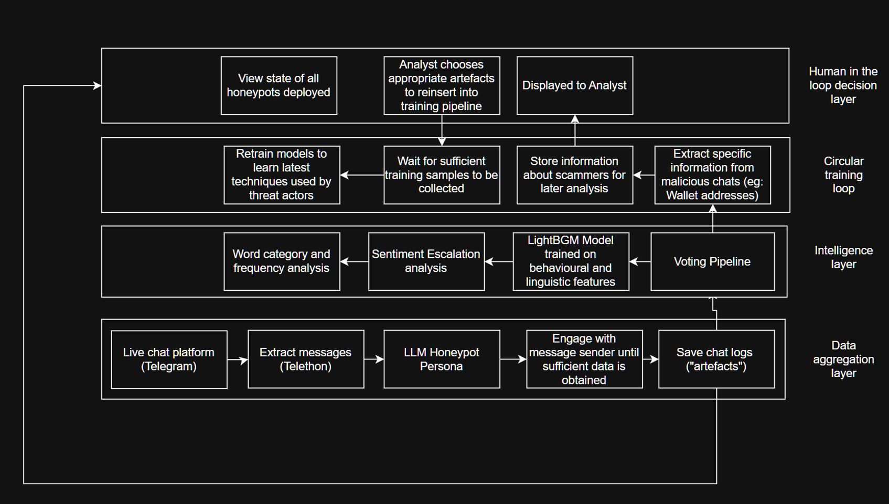

## lemon-tea
The project's goal is to create an intelligent, self-improving honeypot system designed to dynamically engage with, analyze, and counter online scammers on the messaging platform Telegram.

Architecture diagram: 

#Important
- Get dataset and train the model using train-detector.py
- Run approach2.py
- Have not implemented the entire solution, missing steps:
  1. Real time demonstration
  2. Analyst tool
    
